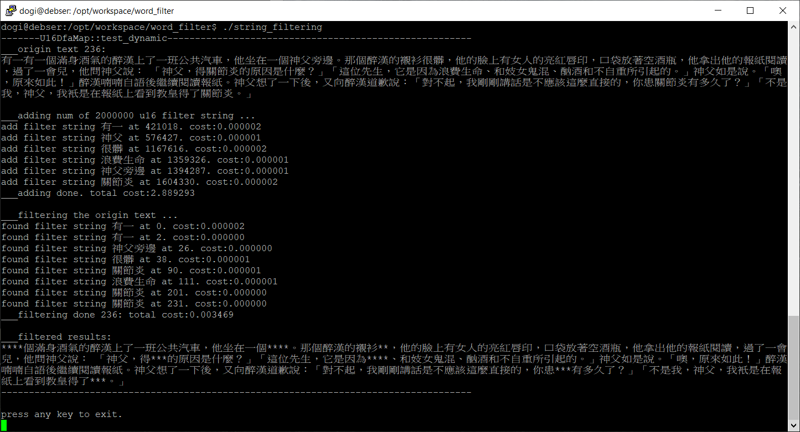

string_filtering
=======

`string_filtering` is a UTF-8/UTF-16 sensitive word filtering program that can filtering a sensitive word from a large dictionary by using Trie tree(Prefix Tree). The idea was come from [Java实现敏感词过滤](https://blog.csdn.net/chenssy/article/details/26961957) but instead of C++ implements.

Feature
--------

*	**Pure C++ 11, Zero-dependency**
  
	Need gcc-5.2 and above for support UTF-16/UTF-8 convertor `<codecvt>`.
	
*	**UTF-8 /UTF-16 aware**

	Can support UTF-8/UTF-16 for input string. 

*	**Fast for comparing**

	`200` texts of comparison only need `0.003` secs on i7-7700k machine.

Screenshot
-------



How to use?
-------

*	**Create dictionary**
  
	`U16DfaMap *root_map = new U16DfaMap(0);`
	
*	**Add sensitive word to dictionary**

	```
	u16string u16 = cvt_utf8_utf16(string("utf-8 based sensitive word"));
	root_map->add(u16, print);
	```
	
*	**Find text from dictionary**

	The ret will return `1` is means sensitive word found from dictionary and also the lastest node, `0` is is means sensitive word found but not the lastest node and `-1` is not sensitive word found.
	```
	int ret = root_map->find(u16, /*print*/0);
	```
	
*	**Free the dictionary**

	`delete root_map`

Compling
-------

Need gcc-5.2.0 unix environment. Use the followings command to build.

```
make
```

and use the followings command to clean.

```
make clean
```

That's all. Thanks!


License
-------

Permission to use, copy, modify, and distribute this software for any
purpose with or without fee is hereby granted, provided that the above
copyright notice and this permission notice appear in all copies.

THE SOFTWARE IS PROVIDED "AS IS" AND THE AUTHOR DISCLAIMS ALL WARRANTIES
WITH REGARD TO THIS SOFTWARE INCLUDING ALL IMPLIED WARRANTIES OF
MERCHANTABILITY AND FITNESS. IN NO EVENT SHALL THE AUTHOR BE LIABLE FOR
ANY SPECIAL, DIRECT, INDIRECT, OR CONSEQUENTIAL DAMAGES OR ANY DAMAGES
WHATSOEVER RESULTING FROM LOSS OF USE, DATA OR PROFITS, WHETHER IN AN
ACTION OF CONTRACT, NEGLIGENCE OR OTHER TORTIOUS ACTION, ARISING OUT OF
OR IN CONNECTION WITH THE USE OR PERFORMANCE OF THIS SOFTWARE.


